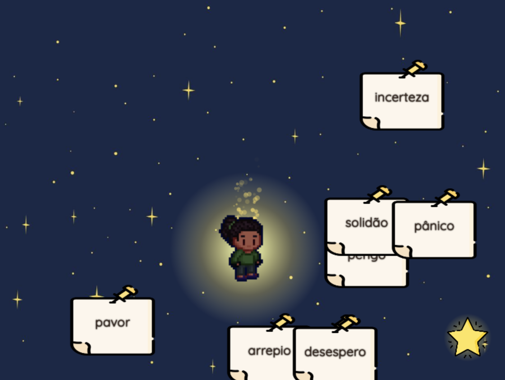
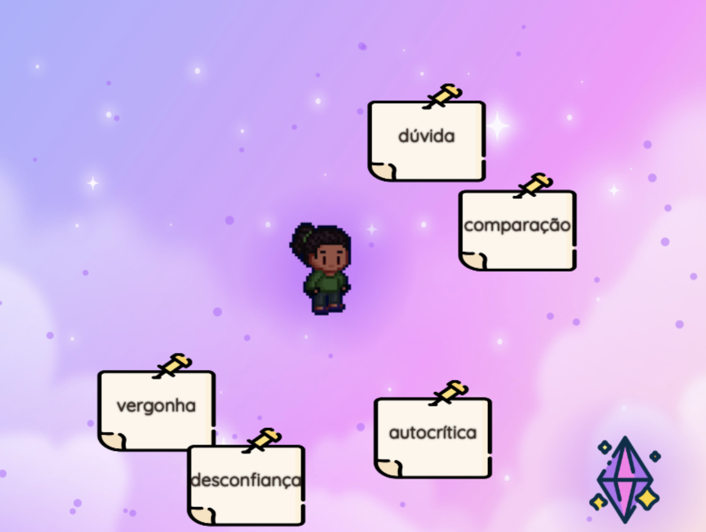
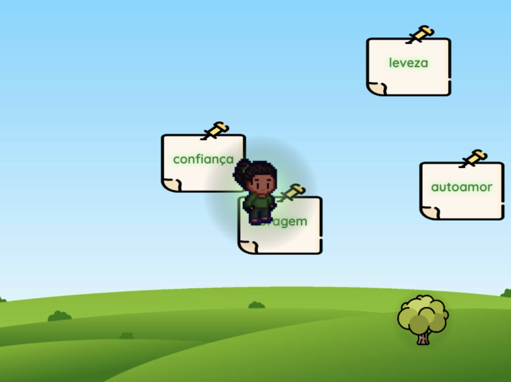

# ☁️ Paper Dream

Jogo digital simples que convida a atravessar três sonhos. Cada fase representa uma emoção que precisa ser ressignificada.

Criado com JavaScript, HTML e CSS, publicado via GitHub Pages.  
- [Jogue agora](https://paolamoura.github.io/paper-dream-game/phase-one/phase-one.html)

---

## Como Jogar

- Use as **setas do teclado** para mover o personagem.
- Interaja com blocos, símbolos e palavras para avançar.
- Há detalhes visuais e trilha sonora.

## Fases do Jogo

### 🟡 Fase 1: Medo

Empurre palavras que te bloqueiam no escuro.  

---

### 🟣 Fase 2: Insegurança

Palavras negativas se movem e tentam te impedir.  

---

### 🟢 Fase 3: Coragem

Transforme palavras negativas em positivas ao tocá-las.  

---

## Tecnologias

- HTML5 + CSS3
- JavaScript
- GitHub Pages
